```python
import pandas as pd
import numpy as np
import matplotlib.pyplot as plt
import seaborn as sns
from pathlib import Path

plt.style.use("ggplot")
```


```python
data_dir = Path("data")
```

# Understanding the problem


```python
abandoned_carts = pd.read_parquet(data_dir / "abandoned_carts.parquet")
inventory = pd.read_parquet(data_dir / "inventory.parquet")
orders = pd.read_parquet(data_dir / "orders.parquet")
regulars = pd.read_parquet(data_dir / "regulars.parquet")
users = pd.read_parquet(data_dir / "users.parquet")
```


```python
# Basic data exploration
for name, df in {
    "abandoned_carts": abandoned_carts,
    "inventory": inventory,
    "orders": orders,
    "regulars": regulars,
    "users": users,
}.items():
    print(f"\n{name.upper()}")
    display(df.head())
```

    
    ABANDONED_CARTS


<div>
<style scoped>
    .dataframe tbody tr th:only-of-type {
        vertical-align: middle;
    }

    .dataframe tbody tr th {
        vertical-align: top;
    }

    .dataframe thead th {
        text-align: right;
    }
</style>
<table border="1" class="dataframe">
  <thead>
    <tr style="text-align: right;">
      <th></th>
      <th>id</th>
      <th>user_id</th>
      <th>created_at</th>
      <th>variant_id</th>
    </tr>
  </thead>
  <tbody>
    <tr>
      <th>0</th>
      <td>12858560217220</td>
      <td>5c4e5953f13ddc3bc9659a3453356155e5efe4739d7a2b...</td>
      <td>2020-05-20 13:53:24</td>
      <td>[33826459287684, 33826457616516, 3366719212762...</td>
    </tr>
    <tr>
      <th>13</th>
      <td>20352449839236</td>
      <td>9d6187545c005d39e44d0456d87790db18611d7c7379bd...</td>
      <td>2021-06-27 05:24:13</td>
      <td>[34415988179076, 34037940158596, 3450282236326...</td>
    </tr>
    <tr>
      <th>45</th>
      <td>20478401413252</td>
      <td>e83fb0273d70c37a2968fee107113698fd4f389c442c0b...</td>
      <td>2021-07-18 08:23:49</td>
      <td>[34543001337988, 34037939372164, 3411360609088...</td>
    </tr>
    <tr>
      <th>50</th>
      <td>20481783103620</td>
      <td>10c42e10e530284b7c7c50f3a23a98726d5747b8128084...</td>
      <td>2021-07-18 21:29:36</td>
      <td>[33667268116612, 34037940224132, 3443605520397...</td>
    </tr>
    <tr>
      <th>52</th>
      <td>20485321687172</td>
      <td>d9989439524b3f6fc4f41686d043f315fb408b954d6153...</td>
      <td>2021-07-19 12:17:05</td>
      <td>[33667268083844, 34284950454404, 33973246886020]</td>
    </tr>
  </tbody>
</table>
</div>


    
    INVENTORY


<div>
<style scoped>
    .dataframe tbody tr th:only-of-type {
        vertical-align: middle;
    }

    .dataframe tbody tr th {
        vertical-align: top;
    }

    .dataframe thead th {
        text-align: right;
    }
</style>
<table border="1" class="dataframe">
  <thead>
    <tr style="text-align: right;">
      <th></th>
      <th>variant_id</th>
      <th>price</th>
      <th>compare_at_price</th>
      <th>vendor</th>
      <th>product_type</th>
      <th>tags</th>
    </tr>
  </thead>
  <tbody>
    <tr>
      <th>0</th>
      <td>39587297165444</td>
      <td>3.09</td>
      <td>3.15</td>
      <td>heinz</td>
      <td>condiments-dressings</td>
      <td>[table-sauces, vegan]</td>
    </tr>
    <tr>
      <th>1</th>
      <td>34370361229444</td>
      <td>4.99</td>
      <td>5.50</td>
      <td>whogivesacrap</td>
      <td>toilet-roll-kitchen-roll-tissue</td>
      <td>[b-corp, eco, toilet-rolls]</td>
    </tr>
    <tr>
      <th>2</th>
      <td>34284951863428</td>
      <td>3.69</td>
      <td>3.99</td>
      <td>plenty</td>
      <td>toilet-roll-kitchen-roll-tissue</td>
      <td>[kitchen-roll]</td>
    </tr>
    <tr>
      <th>3</th>
      <td>33667283583108</td>
      <td>1.79</td>
      <td>1.99</td>
      <td>thecheekypanda</td>
      <td>toilet-roll-kitchen-roll-tissue</td>
      <td>[b-corp, cruelty-free, eco, tissue, vegan]</td>
    </tr>
    <tr>
      <th>4</th>
      <td>33803537973380</td>
      <td>1.99</td>
      <td>2.09</td>
      <td>colgate</td>
      <td>dental</td>
      <td>[dental-accessories]</td>
    </tr>
  </tbody>
</table>
</div>


    
    ORDERS


<div>
<style scoped>
    .dataframe tbody tr th:only-of-type {
        vertical-align: middle;
    }

    .dataframe tbody tr th {
        vertical-align: top;
    }

    .dataframe thead th {
        text-align: right;
    }
</style>
<table border="1" class="dataframe">
  <thead>
    <tr style="text-align: right;">
      <th></th>
      <th>id</th>
      <th>user_id</th>
      <th>created_at</th>
      <th>order_date</th>
      <th>user_order_seq</th>
      <th>ordered_items</th>
    </tr>
  </thead>
  <tbody>
    <tr>
      <th>10</th>
      <td>2204073066628</td>
      <td>62e271062eb827e411bd73941178d29b022f5f2de9d37f...</td>
      <td>2020-04-30 14:32:19</td>
      <td>2020-04-30</td>
      <td>1</td>
      <td>[33618849693828, 33618860179588, 3361887404045...</td>
    </tr>
    <tr>
      <th>20</th>
      <td>2204707520644</td>
      <td>bf591c887c46d5d3513142b6a855dd7ffb9cc00697f6f5...</td>
      <td>2020-04-30 17:39:00</td>
      <td>2020-04-30</td>
      <td>1</td>
      <td>[33618835243140, 33618835964036, 3361886244058...</td>
    </tr>
    <tr>
      <th>21</th>
      <td>2204838822020</td>
      <td>329f08c66abb51f8c0b8a9526670da2d94c0c6eef06700...</td>
      <td>2020-04-30 18:12:30</td>
      <td>2020-04-30</td>
      <td>1</td>
      <td>[33618891145348, 33618893570180, 3361889766618...</td>
    </tr>
    <tr>
      <th>34</th>
      <td>2208967852164</td>
      <td>f6451fce7b1c58d0effbe37fcb4e67b718193562766470...</td>
      <td>2020-05-01 19:44:11</td>
      <td>2020-05-01</td>
      <td>1</td>
      <td>[33618830196868, 33618846580868, 3361891234624...</td>
    </tr>
    <tr>
      <th>49</th>
      <td>2215889436804</td>
      <td>68e872ff888303bff58ec56a3a986f77ddebdbe5c279e7...</td>
      <td>2020-05-03 21:56:14</td>
      <td>2020-05-03</td>
      <td>1</td>
      <td>[33667166699652, 33667166699652, 3366717122163...</td>
    </tr>
  </tbody>
</table>
</div>


    
    REGULARS


<div>
<style scoped>
    .dataframe tbody tr th:only-of-type {
        vertical-align: middle;
    }

    .dataframe tbody tr th {
        vertical-align: top;
    }

    .dataframe thead th {
        text-align: right;
    }
</style>
<table border="1" class="dataframe">
  <thead>
    <tr style="text-align: right;">
      <th></th>
      <th>user_id</th>
      <th>variant_id</th>
      <th>created_at</th>
    </tr>
  </thead>
  <tbody>
    <tr>
      <th>3</th>
      <td>68e872ff888303bff58ec56a3a986f77ddebdbe5c279e7...</td>
      <td>33618848088196</td>
      <td>2020-04-30 15:07:03</td>
    </tr>
    <tr>
      <th>11</th>
      <td>aed88fc0b004270a62ff1fe4b94141f6b1db1496dbb0c0...</td>
      <td>33667178659972</td>
      <td>2020-05-05 23:34:35</td>
    </tr>
    <tr>
      <th>18</th>
      <td>68e872ff888303bff58ec56a3a986f77ddebdbe5c279e7...</td>
      <td>33619009208452</td>
      <td>2020-04-30 15:07:03</td>
    </tr>
    <tr>
      <th>46</th>
      <td>aed88fc0b004270a62ff1fe4b94141f6b1db1496dbb0c0...</td>
      <td>33667305373828</td>
      <td>2020-05-05 23:34:35</td>
    </tr>
    <tr>
      <th>47</th>
      <td>4594e99557113d5a1c5b59bf31b8704aafe5c7bd180b32...</td>
      <td>33667247341700</td>
      <td>2020-05-06 14:42:11</td>
    </tr>
  </tbody>
</table>
</div>


    
    USERS


<div>
<style scoped>
    .dataframe tbody tr th:only-of-type {
        vertical-align: middle;
    }

    .dataframe tbody tr th {
        vertical-align: top;
    }

    .dataframe thead th {
        text-align: right;
    }
</style>
<table border="1" class="dataframe">
  <thead>
    <tr style="text-align: right;">
      <th></th>
      <th>user_id</th>
      <th>user_segment</th>
      <th>user_nuts1</th>
      <th>first_ordered_at</th>
      <th>customer_cohort_month</th>
      <th>count_people</th>
      <th>count_adults</th>
      <th>count_children</th>
      <th>count_babies</th>
      <th>count_pets</th>
    </tr>
  </thead>
  <tbody>
    <tr>
      <th>2160</th>
      <td>0e823a42e107461379e5b5613b7aa00537a72e1b0eaa7a...</td>
      <td>Top Up</td>
      <td>UKH</td>
      <td>2021-05-08 13:33:49</td>
      <td>2021-05-01 00:00:00</td>
      <td>NaN</td>
      <td>NaN</td>
      <td>NaN</td>
      <td>NaN</td>
      <td>NaN</td>
    </tr>
    <tr>
      <th>1123</th>
      <td>15768ced9bed648f745a7aa566a8895f7a73b9a47c1d4f...</td>
      <td>Top Up</td>
      <td>UKJ</td>
      <td>2021-11-17 16:30:20</td>
      <td>2021-11-01 00:00:00</td>
      <td>NaN</td>
      <td>NaN</td>
      <td>NaN</td>
      <td>NaN</td>
      <td>NaN</td>
    </tr>
    <tr>
      <th>1958</th>
      <td>33e0cb6eacea0775e34adbaa2c1dec16b9d6484e6b9324...</td>
      <td>Top Up</td>
      <td>UKD</td>
      <td>2022-03-09 23:12:25</td>
      <td>2022-03-01 00:00:00</td>
      <td>NaN</td>
      <td>NaN</td>
      <td>NaN</td>
      <td>NaN</td>
      <td>NaN</td>
    </tr>
    <tr>
      <th>675</th>
      <td>57ca7591dc79825df0cecc4836a58e6062454555c86c35...</td>
      <td>Top Up</td>
      <td>UKI</td>
      <td>2021-04-23 16:29:02</td>
      <td>2021-04-01 00:00:00</td>
      <td>NaN</td>
      <td>NaN</td>
      <td>NaN</td>
      <td>NaN</td>
      <td>NaN</td>
    </tr>
    <tr>
      <th>4694</th>
      <td>085d8e598139ce6fc9f75d9de97960fa9e1457b409ec00...</td>
      <td>Top Up</td>
      <td>UKJ</td>
      <td>2021-11-02 13:50:06</td>
      <td>2021-11-01 00:00:00</td>
      <td>NaN</td>
      <td>NaN</td>
      <td>NaN</td>
      <td>NaN</td>
      <td>NaN</td>
    </tr>
  </tbody>
</table>
</div>


## Objectives

- Data Overview
- Merge Data
- Understand buying behavior


## Data Overview


### Users


```python
users.info()
```

    <class 'pandas.core.frame.DataFrame'>
    Index: 4983 entries, 2160 to 3360
    Data columns (total 10 columns):
     #   Column                 Non-Null Count  Dtype  
    ---  ------                 --------------  -----  
     0   user_id                4983 non-null   object 
     1   user_segment           4983 non-null   object 
     2   user_nuts1             4932 non-null   object 
     3   first_ordered_at       4983 non-null   object 
     4   customer_cohort_month  4983 non-null   object 
     5   count_people           325 non-null    float64
     6   count_adults           325 non-null    float64
     7   count_children         325 non-null    float64
     8   count_babies           325 non-null    float64
     9   count_pets             325 non-null    float64
    dtypes: float64(5), object(5)
    memory usage: 428.2+ KB


```python
users[["user_segment", "user_nuts1"]].describe()
```


<div>
<style scoped>
    .dataframe tbody tr th:only-of-type {
        vertical-align: middle;
    }

    .dataframe tbody tr th {
        vertical-align: top;
    }

    .dataframe thead th {
        text-align: right;
    }
</style>
<table border="1" class="dataframe">
  <thead>
    <tr style="text-align: right;">
      <th></th>
      <th>user_segment</th>
      <th>user_nuts1</th>
    </tr>
  </thead>
  <tbody>
    <tr>
      <th>count</th>
      <td>4983</td>
      <td>4932</td>
    </tr>
    <tr>
      <th>unique</th>
      <td>2</td>
      <td>12</td>
    </tr>
    <tr>
      <th>top</th>
      <td>Top Up</td>
      <td>UKI</td>
    </tr>
    <tr>
      <th>freq</th>
      <td>2643</td>
      <td>1318</td>
    </tr>
  </tbody>
</table>
</div>


```python
# Percentage of users with missing family info
users.count_adults.notnull().mean()
```


    0.06522175396347582


```python
users.describe()
```


<div>
<style scoped>
    .dataframe tbody tr th:only-of-type {
        vertical-align: middle;
    }

    .dataframe tbody tr th {
        vertical-align: top;
    }

    .dataframe thead th {
        text-align: right;
    }
</style>
<table border="1" class="dataframe">
  <thead>
    <tr style="text-align: right;">
      <th></th>
      <th>count_people</th>
      <th>count_adults</th>
      <th>count_children</th>
      <th>count_babies</th>
      <th>count_pets</th>
    </tr>
  </thead>
  <tbody>
    <tr>
      <th>count</th>
      <td>325.000000</td>
      <td>325.000000</td>
      <td>325.000000</td>
      <td>325.000000</td>
      <td>325.000000</td>
    </tr>
    <tr>
      <th>mean</th>
      <td>2.787692</td>
      <td>2.003077</td>
      <td>0.707692</td>
      <td>0.076923</td>
      <td>0.636923</td>
    </tr>
    <tr>
      <th>std</th>
      <td>1.365753</td>
      <td>0.869577</td>
      <td>1.026246</td>
      <td>0.289086</td>
      <td>0.995603</td>
    </tr>
    <tr>
      <th>min</th>
      <td>0.000000</td>
      <td>0.000000</td>
      <td>0.000000</td>
      <td>0.000000</td>
      <td>0.000000</td>
    </tr>
    <tr>
      <th>25%</th>
      <td>2.000000</td>
      <td>2.000000</td>
      <td>0.000000</td>
      <td>0.000000</td>
      <td>0.000000</td>
    </tr>
    <tr>
      <th>50%</th>
      <td>3.000000</td>
      <td>2.000000</td>
      <td>0.000000</td>
      <td>0.000000</td>
      <td>0.000000</td>
    </tr>
    <tr>
      <th>75%</th>
      <td>4.000000</td>
      <td>2.000000</td>
      <td>1.000000</td>
      <td>0.000000</td>
      <td>1.000000</td>
    </tr>
    <tr>
      <th>max</th>
      <td>8.000000</td>
      <td>7.000000</td>
      <td>6.000000</td>
      <td>2.000000</td>
      <td>6.000000</td>
    </tr>
  </tbody>
</table>
</div>


```python
# Take a look at the distribution of variables
# As we only have 2 segments, we can check at the same time if there is any correlation

fig, ax = plt.subplots(2, 3, figsize=(15, 10))

axes = ax.flatten()

users.user_segment.value_counts(normalize=True).sort_index().to_frame().T.plot(
    kind="bar", ax=axes[0]
)
pd.crosstab(users.user_nuts1, users.user_segment).plot(kind="bar", ax=axes[1])
pd.crosstab(users.count_adults, users.user_segment).plot(kind="bar", ax=axes[2])
pd.crosstab(users.count_children, users.user_segment).plot(kind="bar", ax=axes[3])
pd.crosstab(users.count_pets, users.user_segment).plot(kind="bar", ax=axes[4])
pd.crosstab(users.count_babies, users.user_segment).plot(kind="bar", ax=axes[5])

plt.tight_layout()
```


    
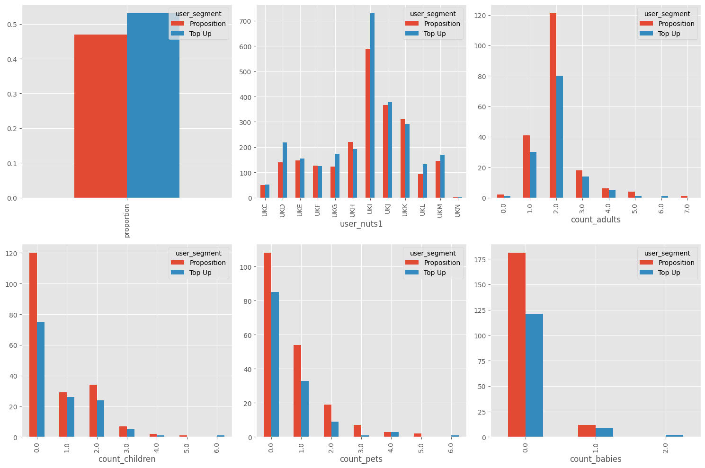
    


```python
users.groupby("user_segment").count_adults.apply(lambda x: x.notnull().mean()).plot(
    kind="bar"
)
```


    <Axes: xlabel='user_segment'>


    
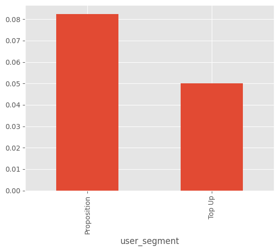
    


### Inventory


```python
inventory.info()
```

    <class 'pandas.core.frame.DataFrame'>
    RangeIndex: 1733 entries, 0 to 1732
    Data columns (total 6 columns):
     #   Column            Non-Null Count  Dtype  
    ---  ------            --------------  -----  
     0   variant_id        1733 non-null   int64  
     1   price             1733 non-null   float64
     2   compare_at_price  1733 non-null   float64
     3   vendor            1733 non-null   object 
     4   product_type      1733 non-null   object 
     5   tags              1733 non-null   object 
    dtypes: float64(2), int64(1), object(3)
    memory usage: 81.4+ KB


```python
inventory[["vendor", "product_type"]].describe()
```


<div>
<style scoped>
    .dataframe tbody tr th:only-of-type {
        vertical-align: middle;
    }

    .dataframe tbody tr th {
        vertical-align: top;
    }

    .dataframe thead th {
        text-align: right;
    }
</style>
<table border="1" class="dataframe">
  <thead>
    <tr style="text-align: right;">
      <th></th>
      <th>vendor</th>
      <th>product_type</th>
    </tr>
  </thead>
  <tbody>
    <tr>
      <th>count</th>
      <td>1733</td>
      <td>1733</td>
    </tr>
    <tr>
      <th>unique</th>
      <td>412</td>
      <td>59</td>
    </tr>
    <tr>
      <th>top</th>
      <td>biona</td>
      <td>cleaning-products</td>
    </tr>
    <tr>
      <th>freq</th>
      <td>69</td>
      <td>160</td>
    </tr>
  </tbody>
</table>
</div>


```python
inventory.explode("tags")["tags"].describe()
```


    count      4321
    unique      214
    top       vegan
    freq        673
    Name: tags, dtype: object


```python
inventory.describe()
```


<div>
<style scoped>
    .dataframe tbody tr th:only-of-type {
        vertical-align: middle;
    }

    .dataframe tbody tr th {
        vertical-align: top;
    }

    .dataframe thead th {
        text-align: right;
    }
</style>
<table border="1" class="dataframe">
  <thead>
    <tr style="text-align: right;">
      <th></th>
      <th>variant_id</th>
      <th>price</th>
      <th>compare_at_price</th>
    </tr>
  </thead>
  <tbody>
    <tr>
      <th>count</th>
      <td>1.733000e+03</td>
      <td>1733.000000</td>
      <td>1733.000000</td>
    </tr>
    <tr>
      <th>mean</th>
      <td>3.694880e+13</td>
      <td>6.307351</td>
      <td>7.028881</td>
    </tr>
    <tr>
      <th>std</th>
      <td>2.725674e+12</td>
      <td>7.107218</td>
      <td>7.660542</td>
    </tr>
    <tr>
      <th>min</th>
      <td>3.361529e+13</td>
      <td>0.000000</td>
      <td>0.000000</td>
    </tr>
    <tr>
      <th>25%</th>
      <td>3.427657e+13</td>
      <td>2.490000</td>
      <td>2.850000</td>
    </tr>
    <tr>
      <th>50%</th>
      <td>3.927260e+13</td>
      <td>3.990000</td>
      <td>4.490000</td>
    </tr>
    <tr>
      <th>75%</th>
      <td>3.948318e+13</td>
      <td>7.490000</td>
      <td>8.210000</td>
    </tr>
    <tr>
      <th>max</th>
      <td>4.016793e+13</td>
      <td>59.990000</td>
      <td>60.000000</td>
    </tr>
  </tbody>
</table>
</div>


```python
inventory.vendor.value_counts(normalize=True).head(20).plot(kind="bar", figsize=(15, 5))
```


    <Axes: xlabel='vendor'>


    
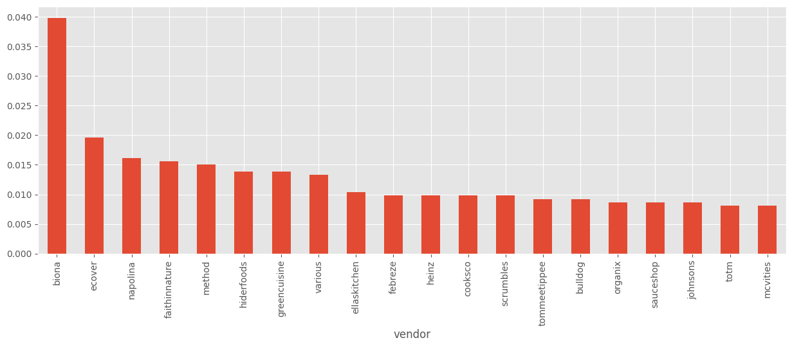
    


```python
inventory.product_type.value_counts(normalize=True).head(50).plot(
    kind="bar", figsize=(15, 5)
)
```


    <Axes: xlabel='product_type'>


    
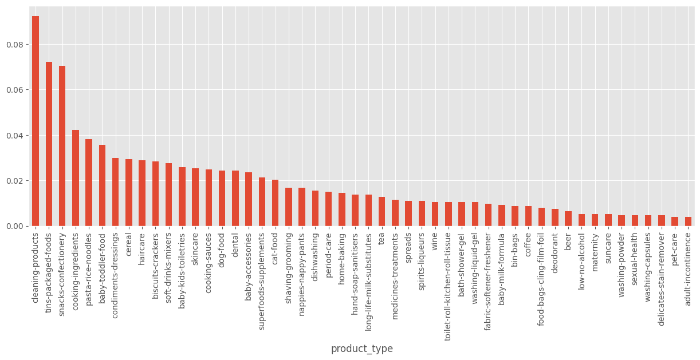
    


```python
inventory.explode("tags").tags.value_counts(normalize=True).head(50).plot(
    kind="bar", figsize=(15, 5)
)
```


    <Axes: xlabel='tags'>


    
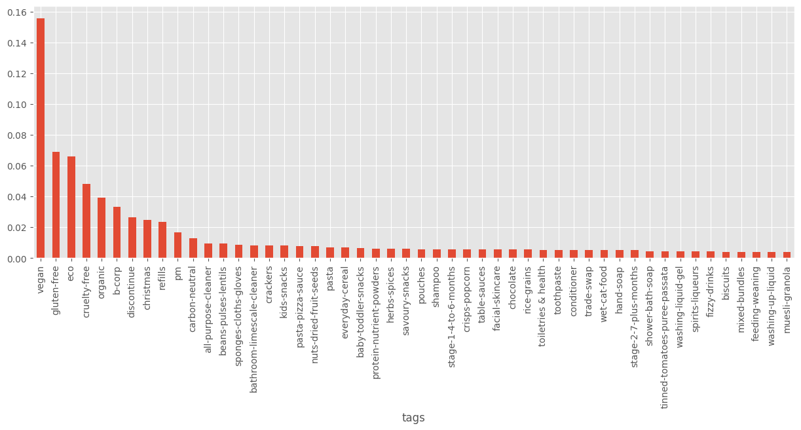
    


### Orders


```python
orders.info()
```

    <class 'pandas.core.frame.DataFrame'>
    Index: 8773 entries, 10 to 64538
    Data columns (total 6 columns):
     #   Column          Non-Null Count  Dtype         
    ---  ------          --------------  -----         
     0   id              8773 non-null   int64         
     1   user_id         8773 non-null   object        
     2   created_at      8773 non-null   datetime64[us]
     3   order_date      8773 non-null   datetime64[us]
     4   user_order_seq  8773 non-null   int64         
     5   ordered_items   8773 non-null   object        
    dtypes: datetime64[us](2), int64(2), object(2)
    memory usage: 479.8+ KB


```python
# Distribution of number of orders per user
n_orders = (
    orders.groupby("user_id")
    .id.nunique()
    .reset_index()
    .rename(columns={"id": "n_orders"})
)
users.merge(n_orders, on="user_id", how="left").fillna(0).n_orders.value_counts(
    normalize=True
).sort_index().plot(kind="bar", figsize=(15, 5))
```


    <Axes: xlabel='n_orders'>


    
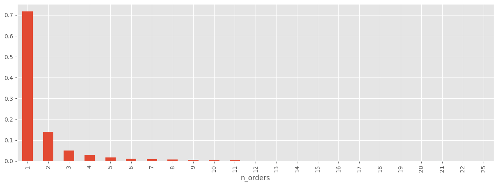
    


```python
# Distribution of the number of items per order
orders.explode("ordered_items").groupby("id").ordered_items.nunique().value_counts(
    normalize=True
).sort_index().head(50).plot(kind="bar", figsize=(15, 5))
```


    <Axes: xlabel='ordered_items'>


    
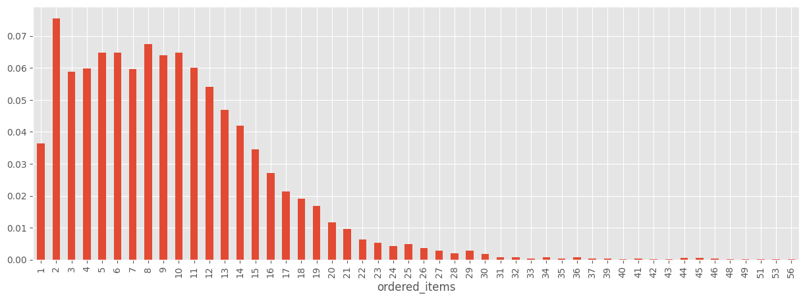
    


### Regulars


```python
regulars.info()
```

    <class 'pandas.core.frame.DataFrame'>
    Index: 18105 entries, 3 to 37720
    Data columns (total 3 columns):
     #   Column      Non-Null Count  Dtype         
    ---  ------      --------------  -----         
     0   user_id     18105 non-null  object        
     1   variant_id  18105 non-null  int64         
     2   created_at  18105 non-null  datetime64[us]
    dtypes: datetime64[us](1), int64(1), object(1)
    memory usage: 565.8+ KB


```python
n_regulars = (
    regulars.groupby("user_id")
    .variant_id.nunique()
    .reset_index()
    .rename(columns={"variant_id": "n_regulars"})
)
users.merge(n_regulars, on="user_id", how="left").fillna(0).n_regulars.value_counts(
    normalize=True
).sort_index().head(20).plot(kind="bar", figsize=(15, 5))
```


    <Axes: xlabel='n_regulars'>


    
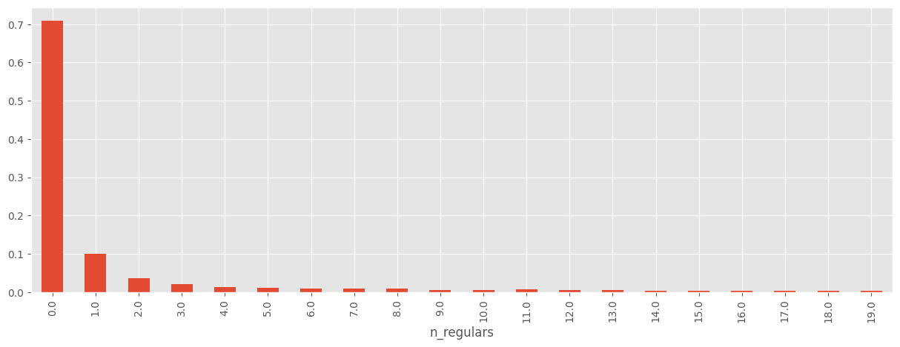
    


### Abandoned Carts


```python
abandoned_carts.info()
```

    <class 'pandas.core.frame.DataFrame'>
    Index: 5457 entries, 0 to 70050
    Data columns (total 4 columns):
     #   Column      Non-Null Count  Dtype         
    ---  ------      --------------  -----         
     0   id          5457 non-null   int64         
     1   user_id     5457 non-null   object        
     2   created_at  5457 non-null   datetime64[us]
     3   variant_id  5457 non-null   object        
    dtypes: datetime64[us](1), int64(1), object(2)
    memory usage: 213.2+ KB


```python
# Check if the ids in abandoned_carts are in orders
orders["id"].isin(abandoned_carts["id"]).any()
```


    False


```python
# Distribution of number of abandoned products per cart
abandoned_carts.explode("variant_id").groupby("id").variant_id.nunique().value_counts(
    normalize=True
).sort_index().head(20).plot(kind="bar", figsize=(15, 5))
```


    <Axes: xlabel='variant_id'>


    
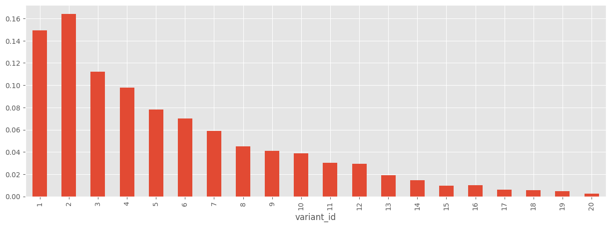
    


```python
# Abandoned carts per user
n_abandoned_carts = (
    abandoned_carts.groupby("user_id")
    .id.nunique()
    .reset_index()
    .rename(columns={"id": "n_abandoned_carts"})
)
users.merge(n_abandoned_carts, on="user_id", how="left").fillna(
    0
).n_abandoned_carts.value_counts(normalize=True).sort_index().head(20).plot(
    kind="bar", figsize=(15, 5)
)
```


    <Axes: xlabel='n_abandoned_carts'>


    
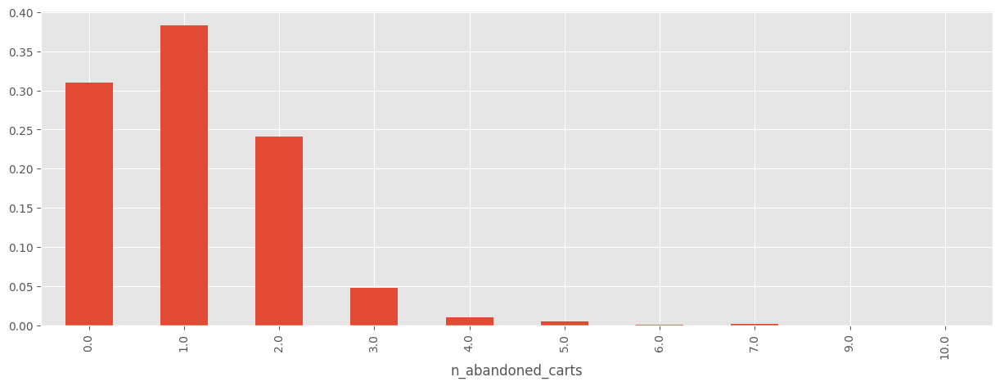
    


## Merge Data


```python
# Dataframe with products buyed by each user (with info about users and products)
ordered_products = (
    orders.explode("ordered_items")
    .rename(columns={"ordered_items": "variant_id", "id": "order_id"})
    .merge(inventory, on="variant_id", how="left")
    .merge(users, on="user_id", how="left")
    .assign(purchased=True)
)
ordered_products.head()
```


<div>
<style scoped>
    .dataframe tbody tr th:only-of-type {
        vertical-align: middle;
    }

    .dataframe tbody tr th {
        vertical-align: top;
    }

    .dataframe thead th {
        text-align: right;
    }
</style>
<table border="1" class="dataframe">
  <thead>
    <tr style="text-align: right;">
      <th></th>
      <th>order_id</th>
      <th>user_id</th>
      <th>created_at</th>
      <th>order_date</th>
      <th>user_order_seq</th>
      <th>variant_id</th>
      <th>price</th>
      <th>compare_at_price</th>
      <th>vendor</th>
      <th>product_type</th>
      <th>...</th>
      <th>user_segment</th>
      <th>user_nuts1</th>
      <th>first_ordered_at</th>
      <th>customer_cohort_month</th>
      <th>count_people</th>
      <th>count_adults</th>
      <th>count_children</th>
      <th>count_babies</th>
      <th>count_pets</th>
      <th>purchased</th>
    </tr>
  </thead>
  <tbody>
    <tr>
      <th>0</th>
      <td>2204073066628</td>
      <td>62e271062eb827e411bd73941178d29b022f5f2de9d37f...</td>
      <td>2020-04-30 14:32:19</td>
      <td>2020-04-30</td>
      <td>1</td>
      <td>33618849693828</td>
      <td>NaN</td>
      <td>NaN</td>
      <td>NaN</td>
      <td>NaN</td>
      <td>...</td>
      <td>Proposition</td>
      <td>UKI</td>
      <td>2020-04-30 14:32:19</td>
      <td>2020-04-01 00:00:00</td>
      <td>4.0</td>
      <td>4.0</td>
      <td>0.0</td>
      <td>0.0</td>
      <td>0.0</td>
      <td>True</td>
    </tr>
    <tr>
      <th>1</th>
      <td>2204073066628</td>
      <td>62e271062eb827e411bd73941178d29b022f5f2de9d37f...</td>
      <td>2020-04-30 14:32:19</td>
      <td>2020-04-30</td>
      <td>1</td>
      <td>33618860179588</td>
      <td>NaN</td>
      <td>NaN</td>
      <td>NaN</td>
      <td>NaN</td>
      <td>...</td>
      <td>Proposition</td>
      <td>UKI</td>
      <td>2020-04-30 14:32:19</td>
      <td>2020-04-01 00:00:00</td>
      <td>4.0</td>
      <td>4.0</td>
      <td>0.0</td>
      <td>0.0</td>
      <td>0.0</td>
      <td>True</td>
    </tr>
    <tr>
      <th>2</th>
      <td>2204073066628</td>
      <td>62e271062eb827e411bd73941178d29b022f5f2de9d37f...</td>
      <td>2020-04-30 14:32:19</td>
      <td>2020-04-30</td>
      <td>1</td>
      <td>33618874040452</td>
      <td>NaN</td>
      <td>NaN</td>
      <td>NaN</td>
      <td>NaN</td>
      <td>...</td>
      <td>Proposition</td>
      <td>UKI</td>
      <td>2020-04-30 14:32:19</td>
      <td>2020-04-01 00:00:00</td>
      <td>4.0</td>
      <td>4.0</td>
      <td>0.0</td>
      <td>0.0</td>
      <td>0.0</td>
      <td>True</td>
    </tr>
    <tr>
      <th>3</th>
      <td>2204073066628</td>
      <td>62e271062eb827e411bd73941178d29b022f5f2de9d37f...</td>
      <td>2020-04-30 14:32:19</td>
      <td>2020-04-30</td>
      <td>1</td>
      <td>33618907005060</td>
      <td>NaN</td>
      <td>NaN</td>
      <td>NaN</td>
      <td>NaN</td>
      <td>...</td>
      <td>Proposition</td>
      <td>UKI</td>
      <td>2020-04-30 14:32:19</td>
      <td>2020-04-01 00:00:00</td>
      <td>4.0</td>
      <td>4.0</td>
      <td>0.0</td>
      <td>0.0</td>
      <td>0.0</td>
      <td>True</td>
    </tr>
    <tr>
      <th>4</th>
      <td>2204073066628</td>
      <td>62e271062eb827e411bd73941178d29b022f5f2de9d37f...</td>
      <td>2020-04-30 14:32:19</td>
      <td>2020-04-30</td>
      <td>1</td>
      <td>33618907005060</td>
      <td>NaN</td>
      <td>NaN</td>
      <td>NaN</td>
      <td>NaN</td>
      <td>...</td>
      <td>Proposition</td>
      <td>UKI</td>
      <td>2020-04-30 14:32:19</td>
      <td>2020-04-01 00:00:00</td>
      <td>4.0</td>
      <td>4.0</td>
      <td>0.0</td>
      <td>0.0</td>
      <td>0.0</td>
      <td>True</td>
    </tr>
  </tbody>
</table>
<p>5 rows × 21 columns</p>
</div>


```python
# Dataframe with products in abandoned carts (with info about users and products)
abandoned_products = (
    abandoned_carts.explode("variant_id")
    .rename(columns={"id": "order_id"})
    .merge(inventory, on="variant_id", how="left")
    .merge(users, on="user_id", how="left")
    .assign(purchased=False)
)
abandoned_products.tail()
```


<div>
<style scoped>
    .dataframe tbody tr th:only-of-type {
        vertical-align: middle;
    }

    .dataframe tbody tr th {
        vertical-align: top;
    }

    .dataframe thead th {
        text-align: right;
    }
</style>
<table border="1" class="dataframe">
  <thead>
    <tr style="text-align: right;">
      <th></th>
      <th>order_id</th>
      <th>user_id</th>
      <th>created_at</th>
      <th>variant_id</th>
      <th>price</th>
      <th>compare_at_price</th>
      <th>vendor</th>
      <th>product_type</th>
      <th>tags</th>
      <th>user_segment</th>
      <th>user_nuts1</th>
      <th>first_ordered_at</th>
      <th>customer_cohort_month</th>
      <th>count_people</th>
      <th>count_adults</th>
      <th>count_children</th>
      <th>count_babies</th>
      <th>count_pets</th>
      <th>purchased</th>
    </tr>
  </thead>
  <tbody>
    <tr>
      <th>30864</th>
      <td>22233846218884</td>
      <td>a4da55d51052411e54f98e1b90b19843121866abeaea76...</td>
      <td>2022-03-13 14:12:09</td>
      <td>39482337624196</td>
      <td>15.99</td>
      <td>18.00</td>
      <td>surf</td>
      <td>washing-powder</td>
      <td>[washing-powder]</td>
      <td>Top Up</td>
      <td>UKI</td>
      <td>2022-03-07 13:12:33</td>
      <td>2022-03-01 00:00:00</td>
      <td>NaN</td>
      <td>NaN</td>
      <td>NaN</td>
      <td>NaN</td>
      <td>NaN</td>
      <td>False</td>
    </tr>
    <tr>
      <th>30865</th>
      <td>22233846218884</td>
      <td>a4da55d51052411e54f98e1b90b19843121866abeaea76...</td>
      <td>2022-03-13 14:12:09</td>
      <td>39607712153732</td>
      <td>8.99</td>
      <td>12.00</td>
      <td>comfort</td>
      <td>fabric-softener-freshener</td>
      <td>[fabric-softener-freshener, refills]</td>
      <td>Top Up</td>
      <td>UKI</td>
      <td>2022-03-07 13:12:33</td>
      <td>2022-03-01 00:00:00</td>
      <td>NaN</td>
      <td>NaN</td>
      <td>NaN</td>
      <td>NaN</td>
      <td>NaN</td>
      <td>False</td>
    </tr>
    <tr>
      <th>30866</th>
      <td>22233846317188</td>
      <td>c0e740ecabe7bd19eaed35b5ea9be7bc80c15f32124712...</td>
      <td>2022-03-13 14:12:10</td>
      <td>34284950519940</td>
      <td>9.99</td>
      <td>12.00</td>
      <td>fairy</td>
      <td>dishwashing</td>
      <td>[dishwasher-tablets]</td>
      <td>Top Up</td>
      <td>UKI</td>
      <td>2022-03-07 15:59:54</td>
      <td>2022-03-01 00:00:00</td>
      <td>NaN</td>
      <td>NaN</td>
      <td>NaN</td>
      <td>NaN</td>
      <td>NaN</td>
      <td>False</td>
    </tr>
    <tr>
      <th>30867</th>
      <td>22233846317188</td>
      <td>c0e740ecabe7bd19eaed35b5ea9be7bc80c15f32124712...</td>
      <td>2022-03-13 14:12:10</td>
      <td>39459281174660</td>
      <td>2.99</td>
      <td>4.47</td>
      <td>carex</td>
      <td>hand-soap-sanitisers</td>
      <td>[eco, hand-soap]</td>
      <td>Top Up</td>
      <td>UKI</td>
      <td>2022-03-07 15:59:54</td>
      <td>2022-03-01 00:00:00</td>
      <td>NaN</td>
      <td>NaN</td>
      <td>NaN</td>
      <td>NaN</td>
      <td>NaN</td>
      <td>False</td>
    </tr>
    <tr>
      <th>30868</th>
      <td>22233846317188</td>
      <td>c0e740ecabe7bd19eaed35b5ea9be7bc80c15f32124712...</td>
      <td>2022-03-13 14:12:10</td>
      <td>39482337558660</td>
      <td>12.99</td>
      <td>15.00</td>
      <td>bold</td>
      <td>washing-capsules</td>
      <td>[discontinue, trade-swap, washing-capsules]</td>
      <td>Top Up</td>
      <td>UKI</td>
      <td>2022-03-07 15:59:54</td>
      <td>2022-03-01 00:00:00</td>
      <td>NaN</td>
      <td>NaN</td>
      <td>NaN</td>
      <td>NaN</td>
      <td>NaN</td>
      <td>False</td>
    </tr>
  </tbody>
</table>
</div>


```python
df = pd.concat([ordered_products, abandoned_products], ignore_index=True)
df.info()
```

    <class 'pandas.core.frame.DataFrame'>
    RangeIndex: 138827 entries, 0 to 138826
    Data columns (total 21 columns):
     #   Column                 Non-Null Count   Dtype         
    ---  ------                 --------------   -----         
     0   order_id               138827 non-null  int64         
     1   user_id                138827 non-null  object        
     2   created_at             138827 non-null  datetime64[us]
     3   order_date             107958 non-null  datetime64[us]
     4   user_order_seq         107958 non-null  float64       
     5   variant_id             138827 non-null  object        
     6   price                  121689 non-null  float64       
     7   compare_at_price       121689 non-null  float64       
     8   vendor                 121689 non-null  object        
     9   product_type           121689 non-null  object        
     10  tags                   121689 non-null  object        
     11  user_segment           138827 non-null  object        
     12  user_nuts1             137770 non-null  object        
     13  first_ordered_at       138827 non-null  object        
     14  customer_cohort_month  138827 non-null  object        
     15  count_people           13732 non-null   float64       
     16  count_adults           13732 non-null   float64       
     17  count_children         13732 non-null   float64       
     18  count_babies           13732 non-null   float64       
     19  count_pets             13732 non-null   float64       
     20  purchased              138827 non-null  bool          
    dtypes: bool(1), datetime64[us](2), float64(8), int64(1), object(9)
    memory usage: 21.3+ MB


```python
df.groupby(df.created_at.dt.to_period("M")).price.apply(
    lambda x: x.isnull().mean()
).plot(kind="bar", figsize=(15, 5))
```


    <Axes: xlabel='created_at'>


    
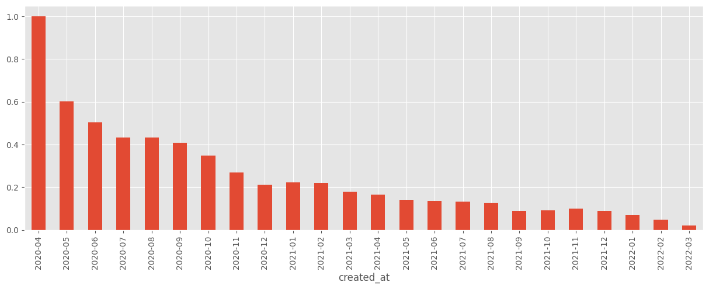
    


```python
# Percentage of products with price in 2020-05
df[df.created_at.dt.to_period("M") == "2020-05"].price.isnull().mean()
```


    0.6009852216748769


```python
# Percentage of products without price
df.loc[df.price.isnull()].variant_id.nunique() / df.variant_id.nunique()
```


    0.30527289546716


```python
# Add regulars to the dataframe
regulars = regulars.assign(regular=True).rename(
    columns={"created_at": "regular_created_at"}
)

# Add regulars to the dataframe
df = (
    df.assign(on_order=True)
    .merge(regulars, on=["user_id", "variant_id"], how="outer")
    .fillna({"regular": False, "purchased": False, "on_order": False})
    .rename(columns={"created_at": "order_created_at"})
)

df.info()
```

    <class 'pandas.core.frame.DataFrame'>
    RangeIndex: 159216 entries, 0 to 159215
    Data columns (total 24 columns):
     #   Column                 Non-Null Count   Dtype         
    ---  ------                 --------------   -----         
     0   order_id               152170 non-null  float64       
     1   user_id                159216 non-null  object        
     2   order_created_at       152170 non-null  datetime64[us]
     3   order_date             117472 non-null  datetime64[us]
     4   user_order_seq         117472 non-null  float64       
     5   variant_id             159216 non-null  object        
     6   price                  134533 non-null  float64       
     7   compare_at_price       134533 non-null  float64       
     8   vendor                 134533 non-null  object        
     9   product_type           134533 non-null  object        
     10  tags                   134533 non-null  object        
     11  user_segment           152170 non-null  object        
     12  user_nuts1             150821 non-null  object        
     13  first_ordered_at       152170 non-null  object        
     14  customer_cohort_month  152170 non-null  object        
     15  count_people           15735 non-null   float64       
     16  count_adults           15735 non-null   float64       
     17  count_children         15735 non-null   float64       
     18  count_babies           15735 non-null   float64       
     19  count_pets             15735 non-null   float64       
     20  purchased              159216 non-null  bool          
     21  on_order               159216 non-null  bool          
     22  regular_created_at     43499 non-null   datetime64[us]
     23  regular                159216 non-null  bool          
    dtypes: bool(3), datetime64[us](3), float64(9), object(9)
    memory usage: 26.0+ MB


    /var/folders/nh/xxsjb94501zck47c260pcjpm0000gn/T/ipykernel_51339/2523364129.py:10: FutureWarning: Downcasting object dtype arrays on .fillna, .ffill, .bfill is deprecated and will change in a future version. Call result.infer_objects(copy=False) instead. To opt-in to the future behavior, set `pd.set_option('future.no_silent_downcasting', True)`
      .fillna({"regular": False, "purchased": False, "on_order": False})


## Buying behavior


```python
# product_type by user_segment
top_20_product_types = df.product_type.value_counts().head(20).index
pd.crosstab(
    df.loc[df.product_type.isin(top_20_product_types), "product_type"],
    df.user_segment,
).loc[top_20_product_types].plot(kind="bar", figsize=(15, 5))
```


    <Axes: xlabel='product_type'>


    
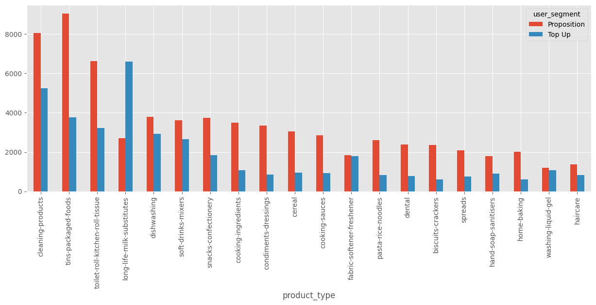
    


```python
# vendors by user_segment
top_20_vendors = df.vendor.value_counts().head(20).index
pd.crosstab(df.loc[df.vendor.isin(top_20_vendors), "vendor"], df.user_segment).loc[
    top_20_vendors
].plot(kind="bar", figsize=(15, 5))
```


    <Axes: xlabel='vendor'>


    
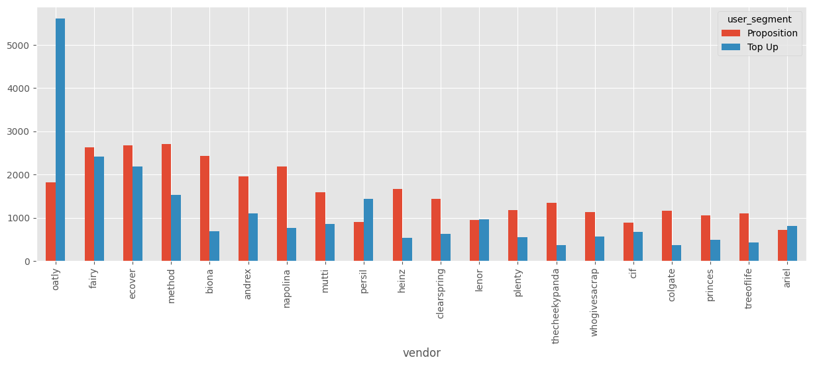
    


```python
# tags by user_segment
tags_df = df.explode("tags").reset_index()
top_20_tags = tags_df.tags.value_counts().head(20).index
pd.crosstab(
    tags_df.loc[tags_df.tags.isin(top_20_tags), "tags"], tags_df.user_segment
).loc[top_20_tags].plot(kind="bar", figsize=(15, 5))
```


    <Axes: xlabel='tags'>


    
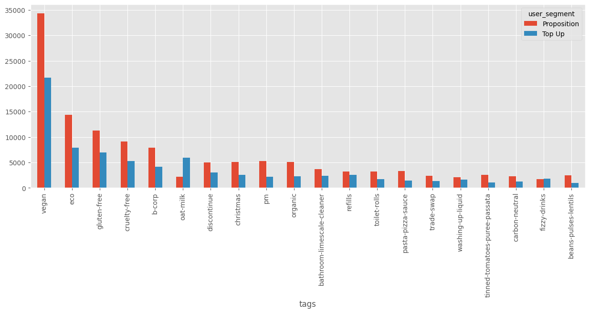
    


```python
# Top 20 products by user_segment
top_20_products = df.variant_id.value_counts().head(20).index
pd.crosstab(
    df.loc[df.variant_id.isin(top_20_products), "variant_id"], df.user_segment
).loc[top_20_products].plot(kind="bar", figsize=(15, 5))
```


    <Axes: xlabel='variant_id'>


    
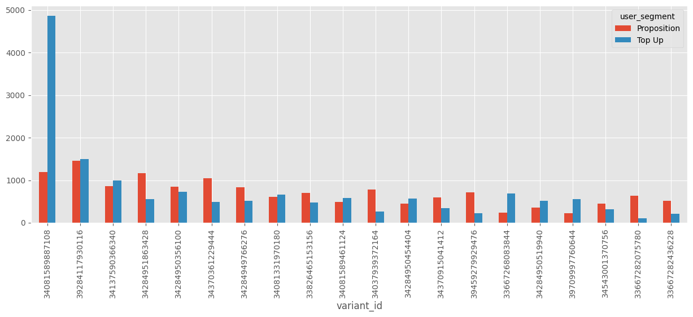
    


```python
extrange_product = top_20_products[0]
inventory.loc[inventory.variant_id == extrange_product].head()
```


<div>
<style scoped>
    .dataframe tbody tr th:only-of-type {
        vertical-align: middle;
    }

    .dataframe tbody tr th {
        vertical-align: top;
    }

    .dataframe thead th {
        text-align: right;
    }
</style>
<table border="1" class="dataframe">
  <thead>
    <tr style="text-align: right;">
      <th></th>
      <th>variant_id</th>
      <th>price</th>
      <th>compare_at_price</th>
      <th>vendor</th>
      <th>product_type</th>
      <th>tags</th>
    </tr>
  </thead>
  <tbody>
    <tr>
      <th>63</th>
      <td>34081589887108</td>
      <td>10.79</td>
      <td>11.94</td>
      <td>oatly</td>
      <td>long-life-milk-substitutes</td>
      <td>[oat-milk, vegan]</td>
    </tr>
  </tbody>
</table>
</div>


```python
print(
    f"Percentage of sales that are from the oatly milk: {df.loc[lambda x: x.purchased].variant_id.eq(extrange_product).mean():.2%}"
)
print(
    f"Percentage of that sales from the Top Up User Segment: {df.loc[lambda x: x.purchased & (x.variant_id == extrange_product)].user_segment.eq('Top Up').mean():.2%}"
)
print(
    f"Percentage of revenue that are from the oatly milk: {df.loc[lambda x: x.purchased & (x.variant_id == extrange_product)].price.sum() / df.loc[lambda x: x.purchased].price.sum():.2%}"
)
```

    Percentage of sales that are from the oatly milk: 4.53%
    Percentage of that sales from the Top Up User Segment: 82.87%
    Percentage of revenue that are from the oatly milk: 10.58%


```python
# Top 20 prouct types by purchased
top_20_product_types = df.product_type.value_counts().head(20).index
pd.crosstab(
    df.loc[df.product_type.isin(top_20_product_types), "product_type"],
    df.purchased,
).loc[top_20_product_types].plot(kind="bar", figsize=(15, 5))
```


    <Axes: xlabel='product_type'>


    
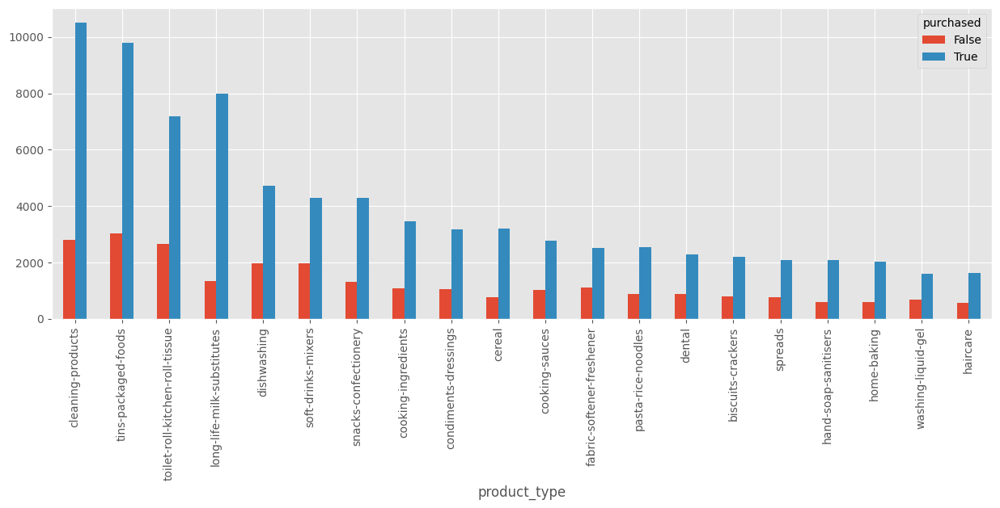
    


```python
purchased_df = df.loc[lambda x: x.purchased]
# Top 20 product types by revenue
purchased_df.groupby("product_type").price.sum().sort_values(ascending=False).head(
    20
).plot(kind="bar", figsize=(15, 5))
```


    <Axes: xlabel='product_type'>


    
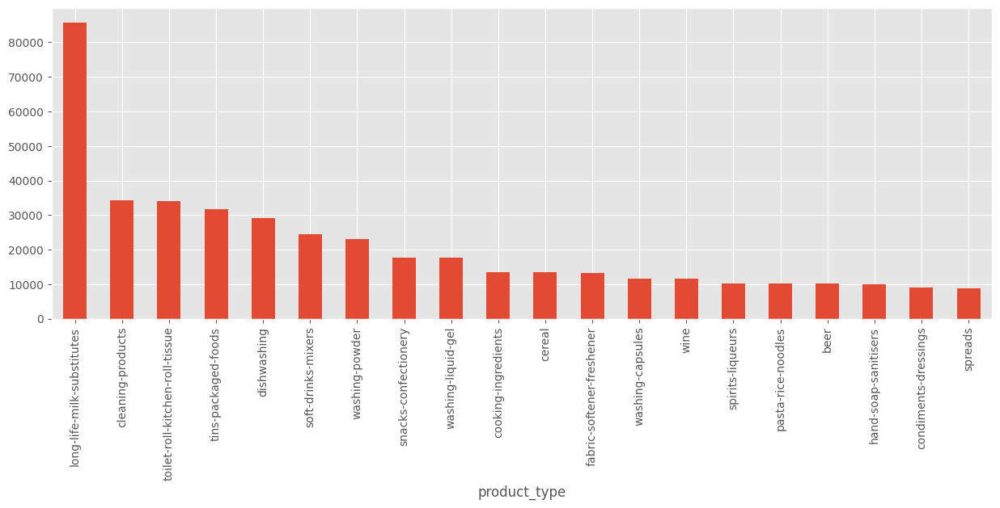
    


```python
# Top 20 vendors by revenue
purchased_df.groupby("vendor").price.sum().sort_values(ascending=False).head(20).plot(
    kind="bar", figsize=(15, 5)
)
```


    <Axes: xlabel='vendor'>


    
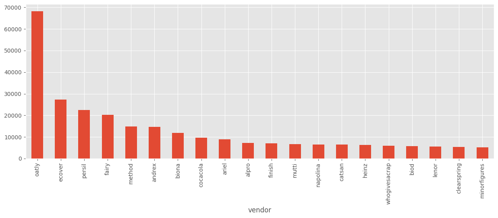
    


```python
# Top 20 products by tags
purchased_df.explode("tags").groupby("tags").price.sum().sort_values(
    ascending=False
).head(20).plot(kind="bar", figsize=(15, 5))
```


    <Axes: xlabel='tags'>


    
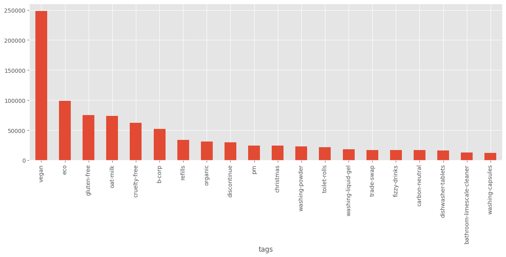
    


```python
# Revenue by user segment
purchased_df.groupby("user_segment").price.sum().sort_values(ascending=False).plot(
    kind="bar", figsize=(15, 5)
)
```


    <Axes: xlabel='user_segment'>


    
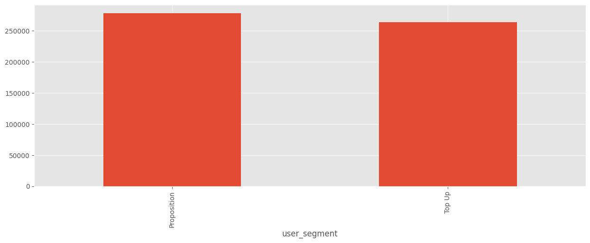
    


## Conclusions

- **Only 6.5% of users have family information** (Is more common to have family info from Proposition User Segment)
- By far the vendor with more products is biona (4% of products) and the tag most present is vegan (15% of products)
- There is a clear top 3 product type in our inventory: cleaning-products (9%), tins-packaged-foods (7%) and snacks-confectionery (7%)
- **Most users only buy one time (71% of users)**
- Orders tend to have between 2 and 12 products
- Most users don't have any regular (70% of users)
- Most users have at least one abandoned cart (68% of users)
- **30% of ordered products don't have product info**, most of the products with no info are from older orders (For example: 65% of product ordered in May of 2020 don't have product data)
- There is a star product (4.53% of sales, 10.5% of the revenue), a vegan oatly milk that is more popular from the Top Up User Segment (85% of oatly milk sales)


# EDA


```python
eda_df = pd.read_csv(Path("data") / "feature_frame.csv")
```


```python
eda_df.info(show_counts=True)
eda_df.head()
```

    <class 'pandas.core.frame.DataFrame'>
    RangeIndex: 2880549 entries, 0 to 2880548
    Data columns (total 27 columns):
     #   Column                            Non-Null Count    Dtype  
    ---  ------                            --------------    -----  
     0   variant_id                        2880549 non-null  int64  
     1   product_type                      2880549 non-null  object 
     2   order_id                          2880549 non-null  int64  
     3   user_id                           2880549 non-null  int64  
     4   created_at                        2880549 non-null  object 
     5   order_date                        2880549 non-null  object 
     6   user_order_seq                    2880549 non-null  int64  
     7   outcome                           2880549 non-null  float64
     8   ordered_before                    2880549 non-null  float64
     9   abandoned_before                  2880549 non-null  float64
     10  active_snoozed                    2880549 non-null  float64
     11  set_as_regular                    2880549 non-null  float64
     12  normalised_price                  2880549 non-null  float64
     13  discount_pct                      2880549 non-null  float64
     14  vendor                            2880549 non-null  object 
     15  global_popularity                 2880549 non-null  float64
     16  count_adults                      2880549 non-null  float64
     17  count_children                    2880549 non-null  float64
     18  count_babies                      2880549 non-null  float64
     19  count_pets                        2880549 non-null  float64
     20  people_ex_baby                    2880549 non-null  float64
     21  days_since_purchase_variant_id    2880549 non-null  float64
     22  avg_days_to_buy_variant_id        2880549 non-null  float64
     23  std_days_to_buy_variant_id        2880549 non-null  float64
     24  days_since_purchase_product_type  2880549 non-null  float64
     25  avg_days_to_buy_product_type      2880549 non-null  float64
     26  std_days_to_buy_product_type      2880549 non-null  float64
    dtypes: float64(19), int64(4), object(4)
    memory usage: 593.4+ MB


<div>
<style scoped>
    .dataframe tbody tr th:only-of-type {
        vertical-align: middle;
    }

    .dataframe tbody tr th {
        vertical-align: top;
    }

    .dataframe thead th {
        text-align: right;
    }
</style>
<table border="1" class="dataframe">
  <thead>
    <tr style="text-align: right;">
      <th></th>
      <th>variant_id</th>
      <th>product_type</th>
      <th>order_id</th>
      <th>user_id</th>
      <th>created_at</th>
      <th>order_date</th>
      <th>user_order_seq</th>
      <th>outcome</th>
      <th>ordered_before</th>
      <th>abandoned_before</th>
      <th>...</th>
      <th>count_children</th>
      <th>count_babies</th>
      <th>count_pets</th>
      <th>people_ex_baby</th>
      <th>days_since_purchase_variant_id</th>
      <th>avg_days_to_buy_variant_id</th>
      <th>std_days_to_buy_variant_id</th>
      <th>days_since_purchase_product_type</th>
      <th>avg_days_to_buy_product_type</th>
      <th>std_days_to_buy_product_type</th>
    </tr>
  </thead>
  <tbody>
    <tr>
      <th>0</th>
      <td>33826472919172</td>
      <td>ricepastapulses</td>
      <td>2807985930372</td>
      <td>3482464092292</td>
      <td>2020-10-05 16:46:19</td>
      <td>2020-10-05 00:00:00</td>
      <td>3</td>
      <td>0.0</td>
      <td>0.0</td>
      <td>0.0</td>
      <td>...</td>
      <td>0.0</td>
      <td>0.0</td>
      <td>0.0</td>
      <td>2.0</td>
      <td>33.0</td>
      <td>42.0</td>
      <td>31.134053</td>
      <td>30.0</td>
      <td>30.0</td>
      <td>24.27618</td>
    </tr>
    <tr>
      <th>1</th>
      <td>33826472919172</td>
      <td>ricepastapulses</td>
      <td>2808027644036</td>
      <td>3466586718340</td>
      <td>2020-10-05 17:59:51</td>
      <td>2020-10-05 00:00:00</td>
      <td>2</td>
      <td>0.0</td>
      <td>0.0</td>
      <td>0.0</td>
      <td>...</td>
      <td>0.0</td>
      <td>0.0</td>
      <td>0.0</td>
      <td>2.0</td>
      <td>33.0</td>
      <td>42.0</td>
      <td>31.134053</td>
      <td>30.0</td>
      <td>30.0</td>
      <td>24.27618</td>
    </tr>
    <tr>
      <th>2</th>
      <td>33826472919172</td>
      <td>ricepastapulses</td>
      <td>2808099078276</td>
      <td>3481384026244</td>
      <td>2020-10-05 20:08:53</td>
      <td>2020-10-05 00:00:00</td>
      <td>4</td>
      <td>0.0</td>
      <td>0.0</td>
      <td>0.0</td>
      <td>...</td>
      <td>0.0</td>
      <td>0.0</td>
      <td>0.0</td>
      <td>2.0</td>
      <td>33.0</td>
      <td>42.0</td>
      <td>31.134053</td>
      <td>30.0</td>
      <td>30.0</td>
      <td>24.27618</td>
    </tr>
    <tr>
      <th>3</th>
      <td>33826472919172</td>
      <td>ricepastapulses</td>
      <td>2808393957508</td>
      <td>3291363377284</td>
      <td>2020-10-06 08:57:59</td>
      <td>2020-10-06 00:00:00</td>
      <td>2</td>
      <td>0.0</td>
      <td>0.0</td>
      <td>0.0</td>
      <td>...</td>
      <td>0.0</td>
      <td>0.0</td>
      <td>0.0</td>
      <td>2.0</td>
      <td>33.0</td>
      <td>42.0</td>
      <td>31.134053</td>
      <td>30.0</td>
      <td>30.0</td>
      <td>24.27618</td>
    </tr>
    <tr>
      <th>4</th>
      <td>33826472919172</td>
      <td>ricepastapulses</td>
      <td>2808429314180</td>
      <td>3537167515780</td>
      <td>2020-10-06 10:37:05</td>
      <td>2020-10-06 00:00:00</td>
      <td>3</td>
      <td>0.0</td>
      <td>0.0</td>
      <td>0.0</td>
      <td>...</td>
      <td>0.0</td>
      <td>0.0</td>
      <td>0.0</td>
      <td>2.0</td>
      <td>33.0</td>
      <td>42.0</td>
      <td>31.134053</td>
      <td>30.0</td>
      <td>30.0</td>
      <td>24.27618</td>
    </tr>
  </tbody>
</table>
<p>5 rows × 27 columns</p>
</div>


```python
def find_boolean_like(df, nan_ok=True):
    """
    Devuelve las columnas que solo contienen dos valores distintos.
    Si nan_ok=True permite NaN además de 0/1 o True/False.
    """
    boolish = []
    for col in df.columns:
        unique = df[col].dropna().unique() if nan_ok else df[col].unique()
        if len(unique) == 2:
            # ¿Son exactamente los pares típicos?
            canon = [{0, 1}, {1.0, 0.0}, {True, False}]
            if set(unique) in canon:
                boolish.append(col)
    return boolish


bool_cols = find_boolean_like(eda_df)
print("Flags booleanos detectados :", bool_cols)
```

    Flags booleanos detectados : ['outcome', 'ordered_before', 'abandoned_before', 'active_snoozed', 'set_as_regular', 'count_babies']


```python
label_col = "outcome"
boolean_cols = [
    "ordered_before",
    "abandoned_before",
    "active_snoozed",
    "set_as_regular",
]
categorical_cols = ["product_type", "vendor"]
date_cols = [
    "created_at",
    "order_date",
]
numerical_cols = [
    col
    for col in eda_df.columns
    if col not in boolean_cols + categorical_cols + date_cols + [label_col]
]
```


```python
# Binary variables related to the outcome
cols = 3
rows = int(np.ceil(len(boolean_cols) / cols))
fig, ax = plt.subplots(rows, cols, figsize=(15, 5 * rows))
axes = ax.flatten()
for i, col in enumerate(boolean_cols):
    eda_df.groupby(col)[label_col].mean().plot(kind="bar", ax=axes[i])
    axes[i].set_title(f"% Labeled: {eda_df[col].mean():.2%}")
    axes[i].set_xlabel(col)
    axes[i].set_ylim(0, 1)
plt.tight_layout()
```


    
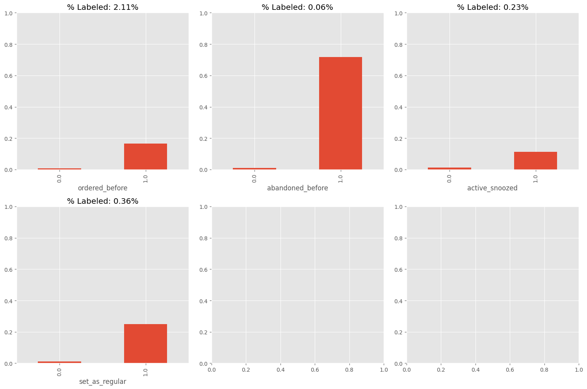
    


```python
# Draw Distribution of numerical variables
cols = 3
rows = int(np.ceil(len(numerical_cols) / cols))
fig, ax = plt.subplots(rows, cols, figsize=(15, 5 * rows))
axes = ax.flatten()
for i, col in enumerate(numerical_cols):
    sns.kdeplot(eda_df.loc[eda_df[label_col] == 0, col], ax=axes[i], label="0")
    sns.kdeplot(eda_df.loc[eda_df[label_col] == 1, col], ax=axes[i], label="1")
    axes[i].set_title(col)

plt.tight_layout()
```


    
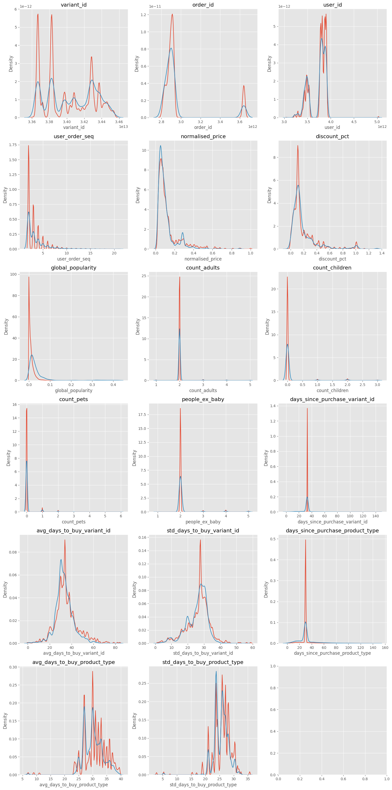
    


```python
# Compute the correlation matrix
corr = eda_df[numerical_cols + [label_col]].corr()

mask = np.triu(np.ones_like(corr, dtype=bool))

fig, ax = plt.subplots(figsize=(15, 10))

sns.heatmap(
    corr,
    mask=mask,
    cmap="coolwarm",
    center=0,
    annot=True,
    fmt=".2f",
    linewidths=0.5,
    cbar_kws={"shrink": 0.8},
)
```


    <Axes: >


    
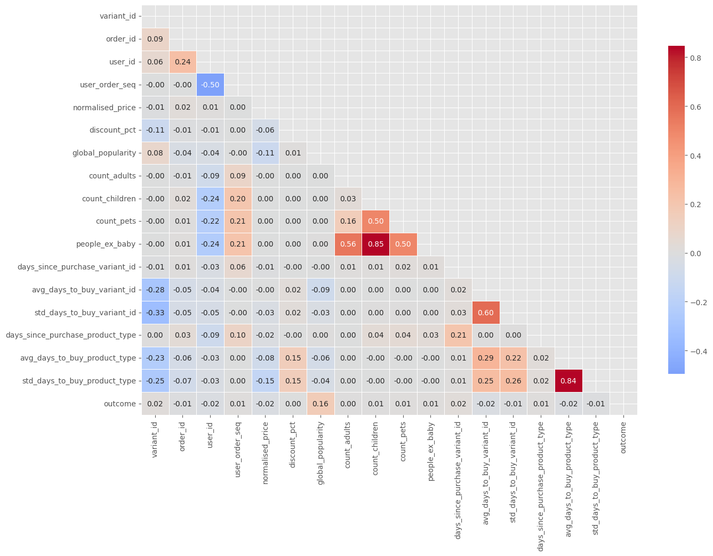
    


```python
eda_df[categorical_cols].describe()
```


<div>
<style scoped>
    .dataframe tbody tr th:only-of-type {
        vertical-align: middle;
    }

    .dataframe tbody tr th {
        vertical-align: top;
    }

    .dataframe thead th {
        text-align: right;
    }
</style>
<table border="1" class="dataframe">
  <thead>
    <tr style="text-align: right;">
      <th></th>
      <th>product_type</th>
      <th>vendor</th>
    </tr>
  </thead>
  <tbody>
    <tr>
      <th>count</th>
      <td>2880549</td>
      <td>2880549</td>
    </tr>
    <tr>
      <th>unique</th>
      <td>62</td>
      <td>264</td>
    </tr>
    <tr>
      <th>top</th>
      <td>tinspackagedfoods</td>
      <td>biona</td>
    </tr>
    <tr>
      <th>freq</th>
      <td>226474</td>
      <td>146828</td>
    </tr>
  </tbody>
</table>
</div>


## Conclusions

- When abandoned_before is flagged, the outcome is true 73 % of the time
- Family information seems to have been mode-imputed
- Categorical labels have a high cardinal. A frecuency encoded is recommended

